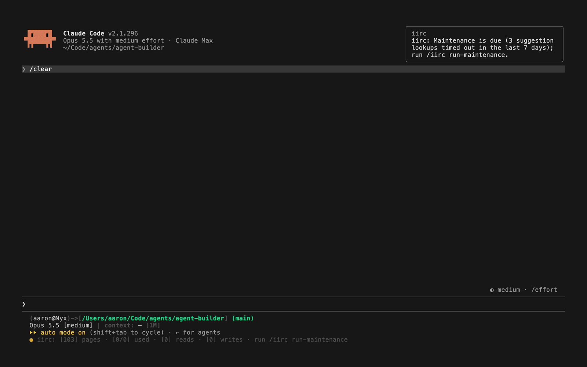
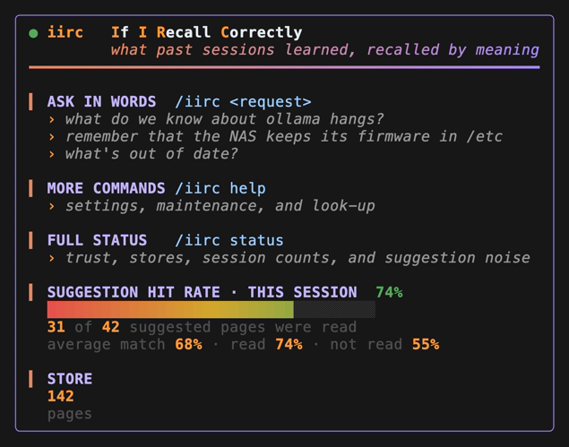
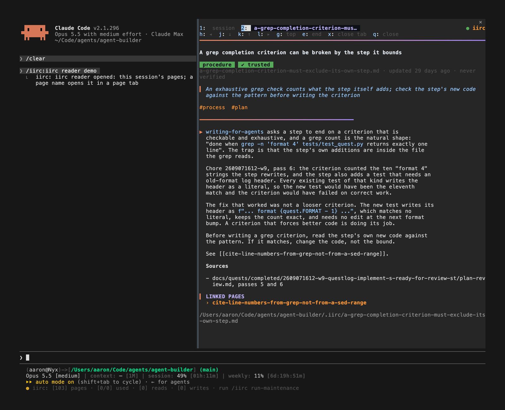

# iirc

A Claude Code plugin that keeps what your agent learns in the repository, searchable by meaning.

The name is "if I recall correctly". It installs as `iirc@dokidlc`; the
repository is `dokidlc-iirc`, prefixed for the dokidlc marketplace.
Pages are markdown files in `.iirc/` in the
[memoryfield](https://github.com/calpaterson/memoryfield-spec) format, so
they travel with the code in git and any memoryfield tool can read them; a
shared iirc repository can hold more. Four parts work together:

- The `iirc` command adds search by meaning and a trust model to
  [memoryfield-tool](https://github.com/calpaterson/memoryfield-tool),
  configured per repository.
- Hooks search the pages on every prompt and every failed shell command,
  and name the matches to the agent with how well each matched.
- A skill tells the agent when to search, when to write, and what to do
  with a page found wrong.
- A hooks module draws what the hooks told the agent, so you see it too.

The agent keeps its pages on its own. It writes one when something took
more than one attempt. A page cites files at a commit, so when a cited file
changes, search marks the page suspect and the agent reads the diff, then
verifies, rewrites, or deletes it in the same turn.

Nothing in the pages needs your approval, and nothing you asked for goes
there. The pages are what the agent learned by itself; documents you review
stay in `docs/`.



## Why another memory system?

Claude Code's own memory lives in a directory under your home, outside the
repository. It is per machine and per user, git never carries it, and it
loads its index into every session. That is the right place for facts about
the machine and about you: which host this is, where the tools are
installed, how you like to be spoken to.

This plugin is for what the agent learns about the project: a quirk of a
tool, a procedure that worked, a finding about the domain, a decision and
its reason. That knowledge belongs with the code, in git, so it reaches
every clone and can be diffed, reviewed, and rolled back like anything
else in the repository. Claude Code loads its memory index, the first 200
lines or 25KB of `MEMORY.md`, into every session, so that memory has to
stay small. iirc pages are found by search rather than loaded whole, so
the store can grow to hundreds of pages and a session pays only for the
pages that match. And it cites files at a commit, which is what
lets a page be marked suspect when the thing it describes changes. Age
alone is only a hint.

| Belongs in | Examples |
|---|---|
| Claude Code's memory | this machine's hostname, local paths, your tone preference, a fact true only here |
| `.iirc/` (this plugin) | the tool that fails to install on macOS and the fix, the port a service listens on and why, the trust model you chose |
| `docs/` | anything you asked for or reviewed: designs, research, decisions with their reasoning |

A page may cite a document in `docs/`. A document never cites
a page. [docs/HOW-IT-WORKS.md](docs/HOW-IT-WORKS.md#iirc-and-claude-codes-own-memory)
compares the two in full, with what each costs in context.

## Status

Experimental. In daily use on two repositories since 2026-09-05. The page
format is fixed; the wrapper's commands, hooks, and drawn rows may change
between pinned commits.

## Prerequisites

- Claude Code 2.1.195 or later, on macOS or Linux. The drawn rows are
  tested on 2.1.295.
- [uv](https://docs.astral.sh/uv/) on PATH
- An embedding model in [ollama](https://ollama.com), here or on a host;
  an OpenAI-compatible host; or a small model on this CPU, no ollama
  needed. Without one, string search finds identifiers only.
- A git repository. The pages persist only if `.iirc/` is committed.

## Installation

Once per machine, in Claude Code:

```
/plugin marketplace add git@github.com:daftdoki/dokidlc-plugins.git
/plugin install iirc@dokidlc
```

Then open a session in a repository and say "set up iirc". The agent
asks where the embedding model runs, and recommends qwen3-embedding when
ollama answers, the CPU model otherwise. It then runs `iirc set-search-backend`,
`iirc init`, and `iirc doctor --fix`, which installs memoryfield-tool at
the pinned commit and, for a local model on macOS, ollama and the model.
You commit what it staged. [INSTALL.md](INSTALL.md) has every step as a command you
run yourself, for a bootstrap script or a container.

A repository that used the earlier memory plugin is offered a migration
at session start; [docs/USAGE.md](docs/USAGE.md#migrate-from-the-memory-plugin)
says what it moves.

## Usage

Mostly you do nothing. Send a prompt and, when pages match, a row appears
under it; click it to list the pages. A second line sits under the prompt
for the whole session, green when all is well, and naming the fixing
command when not:

```
[+] iirc: [3] pages suggested
● iirc: [76] pages · [2/5] used · [12] reads · [4] writes
```

Run `/iirc run-maintenance` about once a week while you use iirc; iirc
tells you when it is due, in the session-start line and the line under
the prompt. It is the only upkeep command you need. It commits and
syncs the stores, checks the pages, and then the agent walks you through
what is left, each change on your yes and each change a commit of its
own. It prints the command that undoes the run. With `--unattended`
(yolo mode) the agent asks once, then decides each change itself; it
still leaves check approvals and URL checks to you.

Ask in words and the agent searches. "Do you remember anything about
installing this on a mac?" runs:

```
$ iirc search "why does install fail on a mac"
pysqlite3-install-override.md: Why memoryfield-tool needs a uv overrides file on macOS and arm64 Linux (distance 0.366; via semantic, install, mac)
```

"Remember that the NAS keeps its live firmware in /etc/default_config"
makes the agent write a page. A plain `/iirc` draws a short card,
`/iirc status` every number, and `/iirc help` the settings and commands.





[docs/USAGE.md](docs/USAGE.md) covers every task, command, and setting;
[docs/UI.md](docs/UI.md) explains every part of what is drawn.

## Caveats

- The hooks fail open, then say so. A dead embedding host is skipped
  after a two-second probe. A bad `.claude/iirc.toml` turns every hook
  off, and the session-start line and the line under the prompt say so.
  A page suggestion that runs past the hook's 5-second limit is logged and counted.
- iirc records what the suggestion hook did on this machine, in
  `~/.local/state/dokidlc-iirc/`, for 90 days: each suggestion line and its
  candidates, each session's numbers, and the first 300 characters of each
  prompt, with anything that looks like a secret redacted. Nothing there is committed or pushed. `/iirc tune-suggestions` runs
  `iirc audit-page-findability`, reads the records, and proposes page fixes and threshold changes, each for your
  yes. See [what iirc records](docs/HOW-IT-WORKS.md#what-iirc-records).
- Every change the agent makes to the pages is committed at once, the
  store's directory and nothing else, so your own staged work stays out.
- The vectors live in the machine's cache directory, one store per model,
  not the repository. A fresh clone or a new model rebuilds them on first use.
- Nothing from a page runs or goes out without you. A check command that
  came with a clone runs only after you approve it, and a page's URLs, and a
  check that contacts the network, run only under
  `iirc find-suspect-pages --network`, which asks first.
- The guard refuses a raw read of a page by pattern, which is a
  convention, not a boundary.
- Two near-duplicate pages make search name the wrong one;
  `/iirc run-maintenance` names each pair and merges or links it on your yes.
- The plugin has to be installed once per machine. `.claude/settings.json`
  can enable it for every clone, but cannot install it.

## Configuration

| Setting | Where | Changed by |
|---|---|---|
| search mode and embedding host | `~/.config/dokidlc-iirc/config.toml` | asking the agent to run `iirc set-search-backend` again |
| pages suggested per prompt, 3 by default | the same file, `max_suggested` | `/iirc max-suggested-pages N` |
| how close a page must be for the hook to suggest it, per model | `.claude/iirc.toml`, `[suggestions.MODEL-ID]` | `/iirc tune-suggestions`, on your yes; `/iirc show-suggestion-thresholds` prints them |

[docs/USAGE.md](docs/USAGE.md#every-setting) lists every setting, with
its default, its range, and when to turn it.

## Other docs

- [docs/HOW-IT-WORKS.md](docs/HOW-IT-WORKS.md): why iirc works the way it does, how it compares with Claude Code's own memory, what each hook adds to the agent's context, where the code is, and what iirc records and why.
- [docs/USAGE.md](docs/USAGE.md): every task, every `/iirc` command, every setting, and how to get good results over time.
- [docs/UI.md](docs/UI.md): what the plugin draws under your prompt and commands, and every part of the line under the prompt and the cards.
- [INSTALL.md](INSTALL.md): every install step as a command, with the trap each one hides.
- [skills/iirc/SKILL.md](skills/iirc/SKILL.md): the rules the agent follows for searching, writing, and doubt.
- [skills/iirc/evals/](skills/iirc/evals/): the harness that measured the skill, and the numbers.
- [docs/REVIEW-PASS-RECOMMENDATIONS.md](docs/REVIEW-PASS-RECOMMENDATIONS.md): a review of two fields after two weeks of use, dated 2026-09-19, from before the plugin was named iirc.
- [DEVELOPMENT.md](DEVELOPMENT.md): working on the plugin itself.

## Support

File a bug or ask a question in
[GitHub issues](https://github.com/daftdoki/dokidlc-iirc/issues).

## Built on memoryfields

The idea, the page format, and the page engine are Cal Paterson's: the
[article](https://calpaterson.com/memoryfields.html), the [format
specification](https://github.com/calpaterson/memoryfield-spec) (MIT),
[memoryfield-tool](https://github.com/calpaterson/memoryfield-tool)
(AGPL-3.0-or-later), and [his skill for
agents](https://github.com/calpaterson/memoryfield-skill) (MIT). The tool
is installed as published at the commit in `iirc.pin`; nothing from it is
copied here.

## License

MIT, DaftDoki. See [LICENSE](LICENSE).
