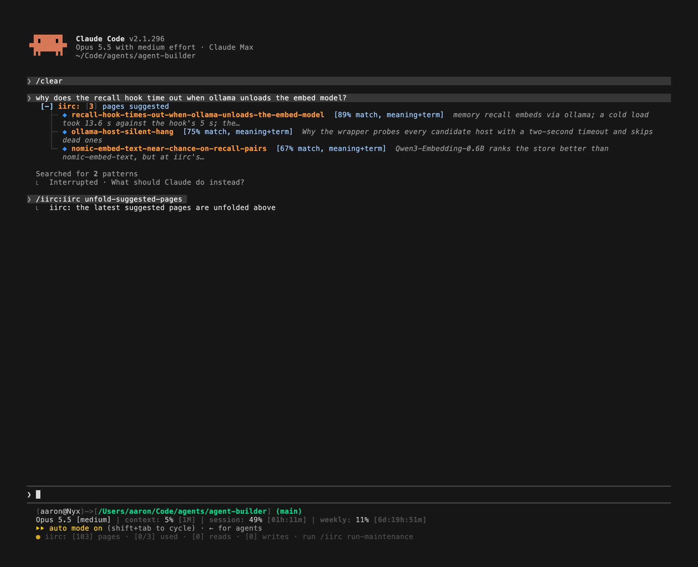
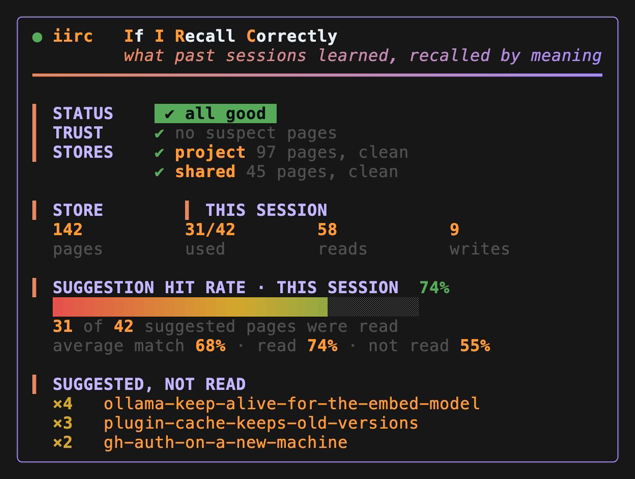
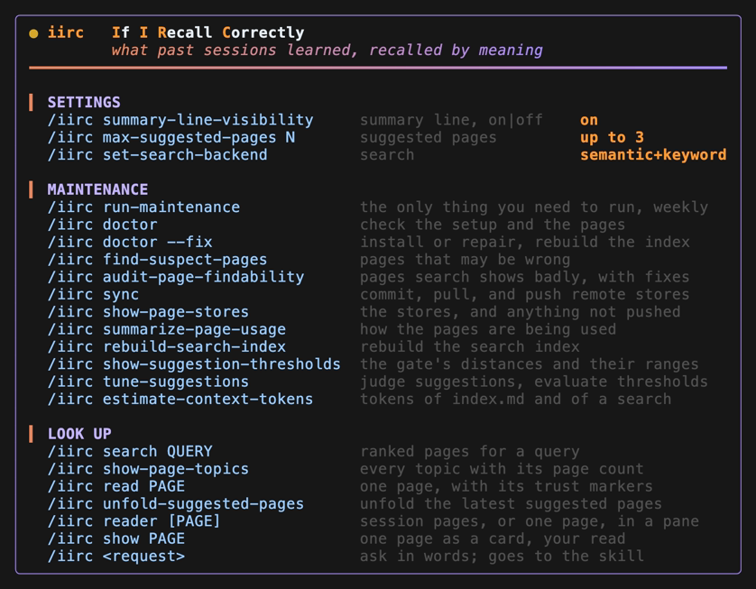
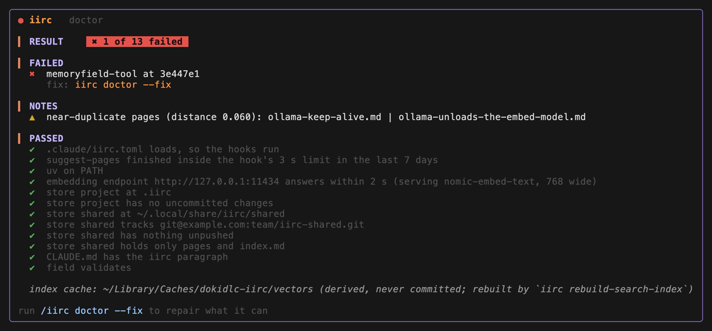
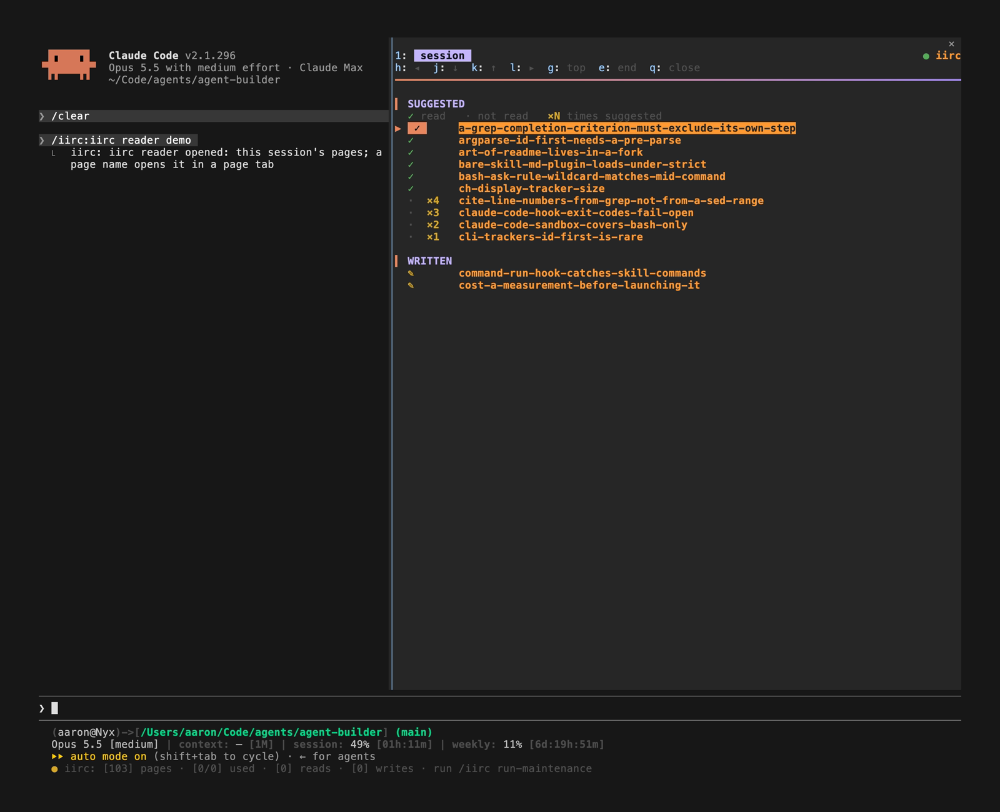
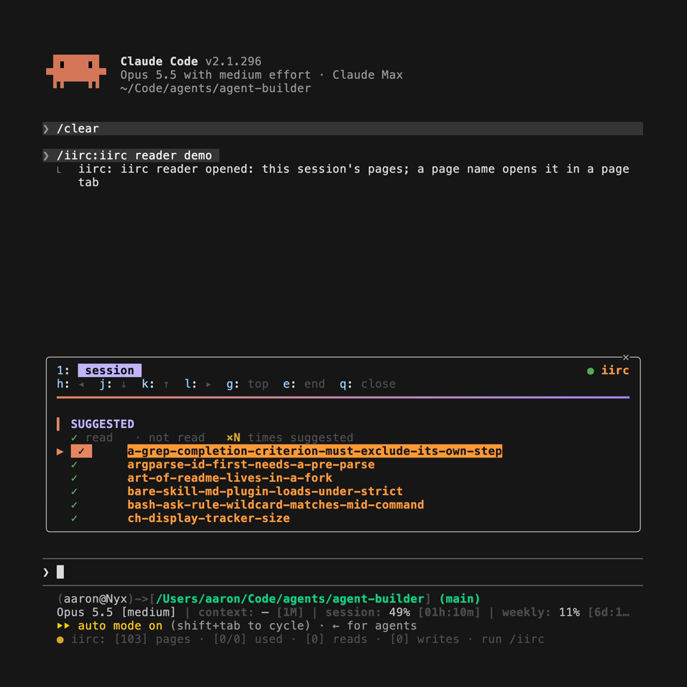
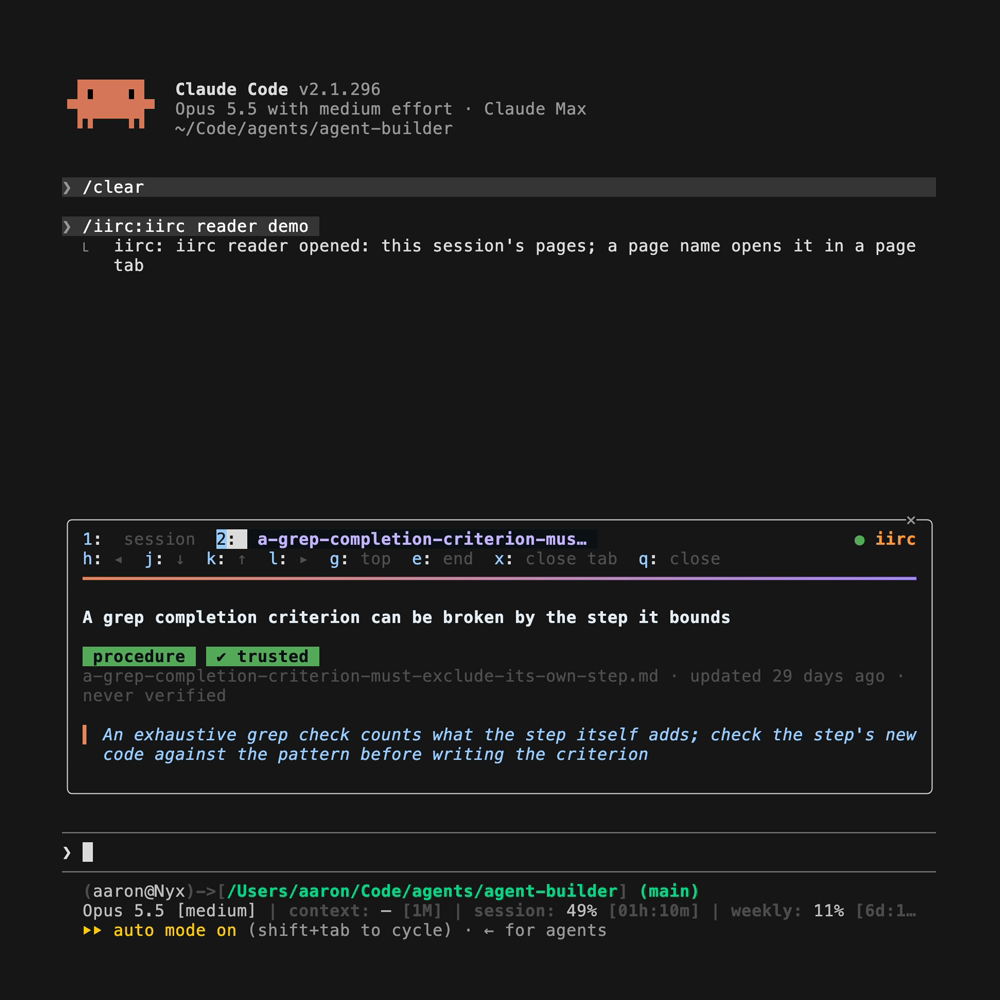
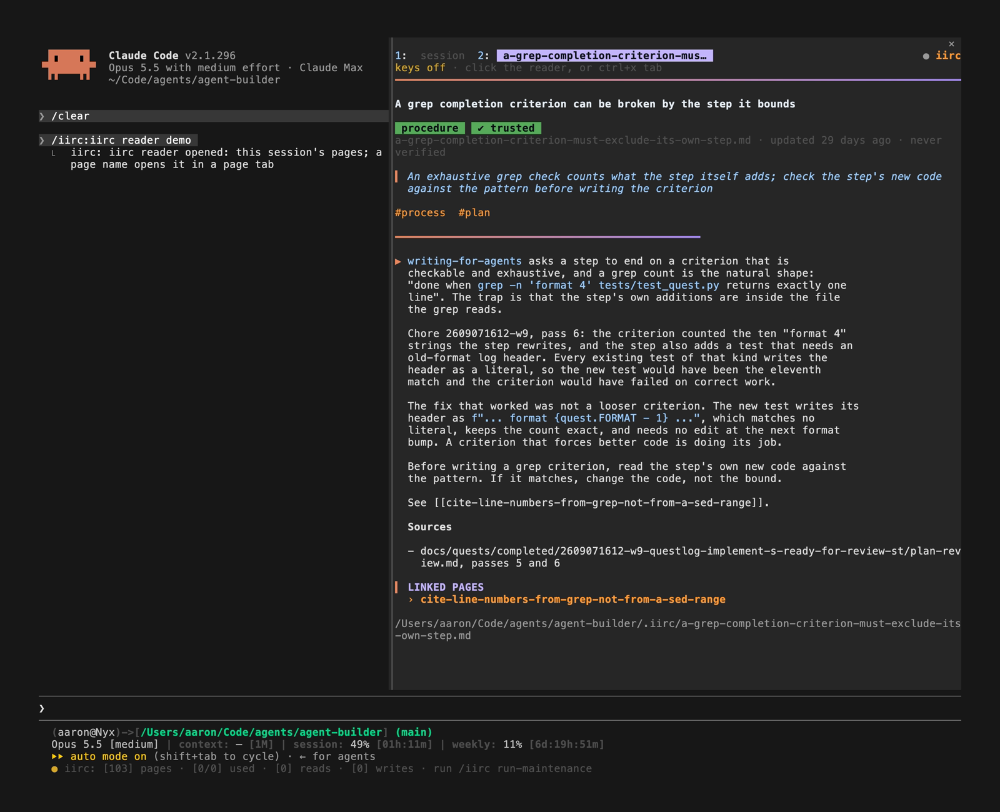
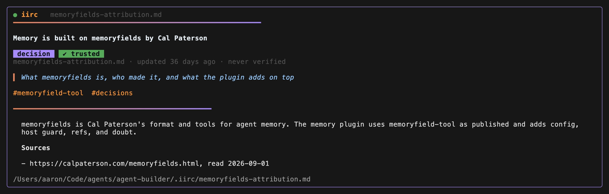

# What iirc draws for you

The hooks put lines into the agent's context that you never see. The
plugin's hooks module, `hooks/register.tsx`, catches each of those lines as
Claude Code stores it and draws it for you. It is on by default. It is
tested on Claude Code 2.1.295.

## Under your prompt

![A prompt with the folded row under it: [+] iirc: [3] pages suggested; Claude Code's status lines and the iirc line at the bottom](images/iirc-prompt-row.png)



A click on `[+]` unfolds the row; `/iirc unfold-suggested-pages` unfolds the latest one from the keyboard.

When the suggestion hook finds pages for your prompt, a row appears under it:

```
[+] iirc: [3] pages suggested
```

Click anywhere on the row to open the list:

```
[−] iirc: [3] pages suggested
  ├─ ◆ run-a-plugin-from-its-source-checkout  [73% match, meaning+term]
  │  Directory marketplace with source ./ in the plugin repo, installed at
  │  local scope with…
  ├─ ◆ project-settings-do-not-install-plugins  [70% match, meaning+term]
  │  Since 2.1.195 settings only enable plugins; each machine runs claude
  │  plugin install…
  └─ ◆ questlog-format-bump-window-run-from-checkout  [66% match,
     meaning+term]  After a format bump commits here, the installed plugin
     refuses every verb until the pin…
```

That list came from the prompt "how do I install a plugin from its source
checkout for development?" in the agent-builder repository.

The diamond is in your theme's success color, green by default, or yellow
on a page iirc suspects is stale. The
bracket after the name says how the page matched:

| Label | Means |
|---|---|
| `[N% match, meaning+term]` | close in meaning, within `both` (at least 62% for nomic by default), and it shares a strong term with your prompt |
| `[N% match, meaning]` | closer in meaning, within `semantic_only` (at least 72% for nomic by default), with no shared strong term |
| `[term match]` | found by an identifier alone, a rare term with digits or punctuation such as `2.1.290` or `session.append`; every page reads this way in keyword mode |

N is 100 less the semantic distance as a percentage. Each model has its
own distance scale, so compare percentages only under one model. A strong
term appears in at most a tenth of the pages, and has digits or
punctuation in it or is a word of five letters or more from the page's
name, title, or summary that is not common English. The agent sees the
same label in its line, and a page appears once per session until the
context is compacted.

A suggestion line names up to 3 pages. `/iirc max-suggested-pages N` changes that, from 1
to 10, and `/iirc max-suggested-pages` prints the number. It is kept in
`~/.config/dokidlc-iirc/config.toml` as `max_suggested`, so it holds on
that machine.

## Under a command

A shell command that fails is searched with its error text, and the pages
it finds appear under it in the same form, as `pages suggested for this
error`. A command that failed twice and then worked gets a row saying the
agent was asked to write the fix as a page. When the command sits in a
folded group of tool calls, the rows appear under the group.

## The line under the prompt

Beside Claude Code's own hint, one line sums up iirc for the session:

```
● iirc: [76] pages · [2/5] used · [12] reads · [4] writes
```

| Part | Means |
|---|---|
| `●` | green when all is well; yellow when the session-start check has a warning, such as a suspect page or two pages that read as duplicates, or when a suggestion line this session ran past the hook's time limit; red when iirc needs setup, an init, or a migration, or when a bad `.claude/iirc.toml` turned the hooks off (`iirc: hooks off`) |
| `[76] pages` | the pages in every store |
| `[2/5] used` | of the pages the suggestion hook suggested this session, how many were then read |
| `[12] reads` | different pages this session read with `iirc read` or `iirc read-matching-pages` |
| `[4] writes` | different pages this session wrote |
| `· [2] timed out` | shown only when a suggestion line this session ran past the hook's 5-second limit and Claude Code killed it |
| `· [keyword] mode` | shown only when search is not semantic: no embedding host, or the string fallback chosen at setup |
| `· run /iirc run-maintenance` | shown when the circle is yellow or red: the command that clears it; setup and config errors name `iirc doctor --fix` |

The line updates after each `iirc read`, `read-matching-pages`, `write`, `delete`, `sync`,
`migrate`, `set-search-backend`, `init`, and `doctor`, and after each suggestion line. A status
line cannot carry color, so the line sits in the hint row.

`/iirc summary-line-visibility off` hides it and `/iirc summary-line-visibility on` brings it
back; `/iirc summary-line-visibility` says which. `/iirc status` draws the full
status card, described below.

## A plain `/iirc`, `/iirc status`, and `/iirc help`


A plain `/iirc` draws a short card in place of its output row:

- the name, "If I Recall Correctly", and what the plugin does
- ASK IN WORDS: `/iirc` followed by a request, such as
  `/iirc what do we know about ollama hangs?`, which goes to the skill
- MORE COMMANDS: a pointer to `/iirc help`
- FULL STATUS: a pointer to `/iirc status`, in yellow or red with
  `▲ needs a look` when the status is not green
- SUGGESTION HIT RATE, for this session: the share of suggested pages that
  were read, as a percentage and a bar that runs from red into green as
  it fills, and the average match of the suggestions: all of them, the
  ones read, and the ones not read
- STORE: the page count

`/iirc status` draws every number:



- STATUS: a chip, `✔ all good`, `▲ needs a look`, or `✖` and the red
  state's name, with the command that fixes it, in green, yellow, or red
- TRUST: the number of suspect pages, whose cited file changed since
  they cited it, and up to three by name, with `/iirc run-maintenance` as the fix
- STORES: each store's pages, then `clean` or its uncommitted changes
  and unpushed commits, with `/iirc run-maintenance` as the fix for unpushed ones
- the counts, under STORE (pages) and THIS SESSION (used, reads, and
  writes)
- SUGGESTION HIT RATE, as on the short card
- SUGGESTED, NOT READ: up to three pages the suggestion hook suggested this session
  that nobody read, most often suggested first, with the count. A page
  that keeps coming back here is the suggestion hook's noise.

TRUST and STORES come from `iirc doctor --health`, run as the status card
opens, so they are current. The STATUS chip comes from the session-start
brief; when TRUST or STORES finds a problem the brief did not, the chip
turns yellow and names the fix. `/iirc demo` and `/iirc demo status`
draw the two cards with sample numbers, and `/iirc demo doctor` draws the
doctor card from sample checks.

`/iirc help` draws the rest:



- SETTINGS: the line under the prompt, the number of suggested pages,
  and the search mode, each with its command and current value. `set-search-backend`
  goes to the skill, which asks which embedding model and where it runs
- MAINTENANCE and LOOK UP: first `run-maintenance`, the only thing you
  need to run, about weekly, which goes to the skill. Then the iirc commands `/iirc` runs for you
  directly, printing what they print: `doctor`, `doctor --fix`, `find-suspect-pages`,
  `sync`, `show-page-stores`, `summarize-page-usage`, `rebuild-search-index`, `estimate-context-tokens`, `show-suggestion-thresholds`, `search QUERY`, `show-page-topics`, and
  `read PAGE`. `audit-page-findability` and `tune-suggestions` are maintenance too, but they go to the
  skill, which proposes each fix for your yes. A page you read this way does not count toward the
  session's reads, which are the agent's. `/iirc doctor` draws its checks
  as a card too: a result chip, the failures with their fixes first, then
  notes, then the checks that passed.
- `/iirc <request>`, which goes to the skill, as do the commands that need
  a question first: `add-remote-store`, `init`, `write`, `delete`, and `approve-page-check`



Neither card costs tokens: the plugin answers, and the skill does not load.

## The reader

`/iirc reader` opens the reader, iirc's pane, on this session's pages.
`/iirc reader PAGE` opens it on one page, with the session's pages a tab
away. Claude Code places it beside the transcript when it runs in
fullscreen on a terminal at least 110 columns wide, and above the prompt
otherwise.








Drag the reader's edge to change its width;
Claude Code keeps that width, up to a maximum it sets. A row at its top holds its own
tabs: `session`, and, while a page is open, the page's name. Under it, a row of keys:

| Key | Session tab | Page tab |
|---|---|---|
| `j`, `k` | the next or previous page name | the next or previous paragraph, then each linked page |
| Enter | open the page under the cursor | open the linked page under the cursor |
| `g`, `e` | the top, the end | the top, the end |
| `h`, `l` | the session tab, the page tab | the same |
| `1`, `2`, `b` | the session tab, the page tab | the same, and `b` goes back |
| `x` | | close the page tab, back to the session tab |
| `q` | close the reader | close the reader |

The keys work while the reader has the keyboard. Without it, the `●` beside
`iirc` turns gray and the keys row reads `keys off · click the reader, or
ctrl+x tab, to use j k g e`. The reader asks for it when
it opens, and Claude Code gives it unless you were typing at the prompt;
a click on the reader, or `ctrl+x` then Tab, gives it too. A `▶` and an orange chip on the row's mark show
where `j` and `k` stand, and the reader opens with it on the first page
name. Arrows, Page Up and Down, and the mouse wheel scroll as in any
pane. Shift is not a separate key here, so the end is `e`, not `G`.



The tab row and the keys stay at the top; the wheel, the arrows, and the
page keys scroll the content under them, and `↑ N above` says how much
has scrolled away. Esc hands the keys back to the prompt and leaves the
reader open; `q`, Claude Code's `ctrl+x x`, or the frame's close mark
closes it.

The session tab lists this session's pages; the counts are on `/iirc status`,
so the reader's few rows go to the list:

- SUGGESTED: every page the suggestion hook suggested, read ones first with `✓ read`,
  then the rest with `· not read` and how many times the suggestion hook suggested it
- WRITTEN: the pages the agent wrote, marked `✎`
- SUSPECT: pages whose cited file changed

A click on any page name opens the page in the page tab. Page names are links in the same way under your prompt and
under a failed command, and in the TRUST and SUGGESTED, NOT READ lists
of the `/iirc status` card.

The page tab shows the title, the kind, the store, when the page was
updated and verified, any suspect or glance marker, the summary and
topics, the body, and the path. Pages the body links with `[[name]]` are
listed under LINKED PAGES; a click opens one in the same tab, and Back
(`b` while the reader has the keys) returns to the page before.

A page name outside the reader opens the reader too. Claude Code counts that
open as the plugin's, not yours, and places such a pane only on a
terminal at least 144 columns wide, or 110 once you have opened the reader
yourself with `/iirc reader`. On a narrower terminal a toast says the reader
is waiting.

Reading a page here is your read, not the agent's: it runs `iirc show`,
which the log records as `show`, so the session's reads and hit rate
count only what the agent read.

## A page in the transcript

`/iirc show PAGE` draws a page the way the page tab does, as a card in
the transcript. Like the reader, it is your read, not the agent's.



`scripts/screenshots.sh` makes every image on this page; see
[DEVELOPMENT.md](../DEVELOPMENT.md).

## Toasts

The warnings from the session-start check come as a toast, once per
distinct set of warnings. So does the reminder at stop when a command
failed twice, then worked, and nothing was written. So does the
reminder near compaction, when it reaches the agent.

## Switches in `.claude/iirc.toml`

```toml
ui = false          # draw none of the above (default: on)
show_hooks = true   # also print the raw text each hook gives the agent (default: off)
```

`show_hooks` is for debugging: it shows exactly what reached the model. A
file that holds only these keys keeps the default `.iirc/` store.
